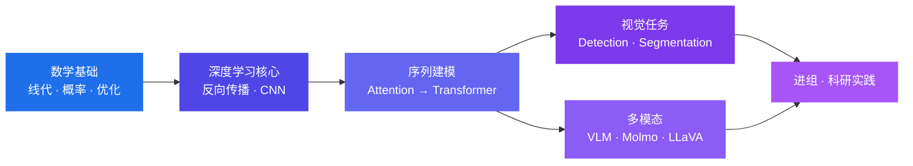

<!-- ═══════════════════════════════════════════════════════════════════════
     GitHub Profile README — IIZOM (WYX-MO)
     部署：把本文件内容复制到 WYX-MO/WYX-MO 仓库的 README.md
     占位符：搜索 "TODO" 补齐邮箱等个人信息
     ═══════════════════════════════════════════════════════════════════════ -->

<div align="center">


<a href="https://github.com/WYX-MO">
  
</a>

<br/>


<a href="mailto:TODO@example.com"></a>
<a href="https://github.com/WYX-MO"></a>
<!-- TODO: 有博客/知乎/ORCID/Google Scholar 之后加在这里
<a href="https://TODO"></a>
<a href="https://orcid.org/TODO"></a>
-->

</div>

---

## 🧭 About

```python
class IIZOM:
    def __init__(self):
        self.affiliation = "Huazhong University of Science and Technology"
        self.major       = "Computer Science"
        self.focus       = ["Computer Vision", "Vision-Language Models", "Deep Learning"]
        self.stack       = ["PyTorch", "OpenCV", "NumPy", "Pandas", "scikit-learn"]
        self.languages   = ["Python", "Java", "C"]
        self.belief      = "把原理搞懂，再谈调参。"

    def current(self) -> str:
        return "Reading papers, rebuilding classic architectures from scratch."
```

> 对**计算机视觉**与**多模态大模型**有强烈兴趣。
> 相信"从零复现"是最好的学习方式 —— 不只是调用 `model.fit()`，而是搞清楚每一个矩阵乘法为什么长这样。

---

## 🔬 Research Interests

<table>
<tr>
<td width="50%" valign="top">

**Computer Vision**
- Image Classification & Backbones
- Object Detection / Segmentation
- Vision Encoders & Representation Learning

</td>
<td width="50%" valign="top">

**Vision-Language Models**
- Multimodal Alignment
- Vision Encoders in VLMs (Molmo, CLIP-style)
- Instruction Tuning for VL Tasks

</td>
</tr>
</table>

**Learning Roadmap** — 正在按这条路径系统性地补齐基础：



---

## 📚 Reading & Notes

我维护着一份持续更新的学习笔记，记录从零复现经典模型的全过程：

| 笔记 | 内容 |
| :--- | :--- |
| **CNN** | 卷积、池化、经典骨干网络的从零实现与实验记录 |
| **Attention** | 注意力机制的数学推导与手写实现 |
| **GPT** | 自回归语言模型的原理拆解 |
| **Molmo** | 多模态视觉语言模型的论文精读与复现尝试 |
| **papers** | 论文精读笔记 |
| **cs231n** | 斯坦福 CS231n 课程作业与实验 |

<!-- TODO: 如果这些笔记有公开仓库，把上面的表格换成链接 -->

---

## 🚀 Selected Projects

<div align="center">
<a href="https://github.com/WYX-MO/orangeWindow">
  
</a>
<a href="https://github.com/WYX-MO/equity_back_sys">
  
</a>
</div>

| Project | Description | Stack |
| :--- | :--- | :--- |
| [**orangeWindow**](https://github.com/WYX-MO/orangeWindow) | 一个便携的多窗口翻译应用 · *A portable multi-window translation tool* | `Python` |
| [**FloatWind**](https://github.com/WYX-MO/FloatWind) | 面向漫画场景的翻译工具 · *Translation tool built for manga workflows* | `Python` |
| [**equity_back_sys**](https://github.com/WYX-MO/equity_back_sys) | 面向企业的股权回收管理系统 · *Equity buy-back system for XY Corp.* | `Python` `SQL Server` `TeX` |
| [**luxin_repair_web**](https://github.com/WYX-MO/luxin_repair_web) | 报修服务 App & Web 端 · *Repair-request platform (app + web)* | `HTML` `JS` |
| [**blog_web**](https://github.com/WYX-MO/blog_web) | 个人博客与一些好玩的东西 · *Personal blog & experiments* | `Web` |
| [**Unique_AI**](https://github.com/WYX-MO/Unique_AI) | 深度学习实验与尝试 · *DL experiments notebook* | `Jupyter` |
| [**DEEPLEARNING**](https://github.com/WYX-MO/DEEPLEARNING) | 深度学习学习路线与实验代码 · *DL roadmap & implementations* | `Python` `PyTorch` |

---

## 🛠 Tech Stack

<div align="center">


<br/><br/>


</div>

---

## 📈 GitHub at a Glance

<div align="center">


<br/>


<br/>


<br/>


</div>

<!-- 贡献热力图，可选（与上面的 streak 二选一即可）
<div align="center">
  
</div>
-->

---

## 📄 Publications

*Working toward it.* — 目前处于进组准备阶段，暂无发表论文。

<!--
模板：有产出后取消注释并填写
- **Title of the Paper**, *Venue 20XX*
  [](LINK)
  [](LINK)
-->

---

## 📫 Get in Touch

<div align="center">

有合作、交流或只是想聊聊视觉与多模态，欢迎找我。

<a href="mailto:TODO@example.com"></a>
<a href="https://github.com/WYX-MO"></a>

<br/><br/>


</div>
